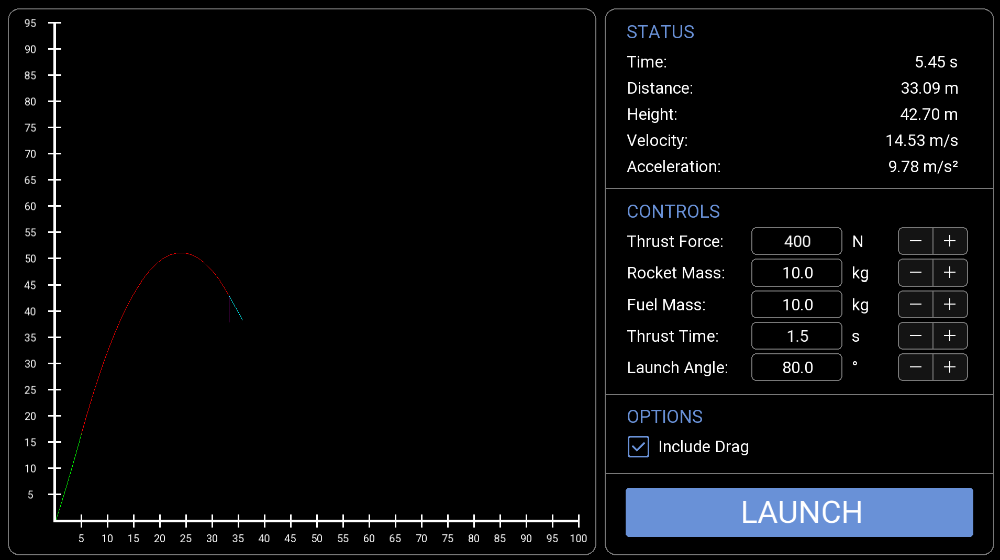

# Rocket Trajectory Simulator

A C++/SFML rocket flight simulator modeling variable-mass propulsion, gravity, and aerodynamic drag.

## Overview

This project is a personal aerospace engineering simulation developed during the summer of 2026. The simulator models the flight of a rocket during powered and unpowered flight while accounting for changing rocket mass, gravitational acceleration, and aerodynamic drag.

The simulator features an interactive graphical interface that allows launch parameters to be modified and the resulting trajectory and flight data to be visualized in real time.

I hope to continue adding to this project.

## Features

- Variable-mass rocket propulsion
- Gravity
- Aerodynamic drag modeling
- Real-time trajectory visualization
- Velocity and acceleration vectors
- Adjustable launch parameters
- Interactive input boxes
- Automatic graph scaling
- Real-time flight statistics
- Drag on/off comparison

## Technologies

- C++
- SFML
- Aerospace flight dynamics
- Variable-mass systems
- Aerodynamic drag modeling
- Analytical modeling
